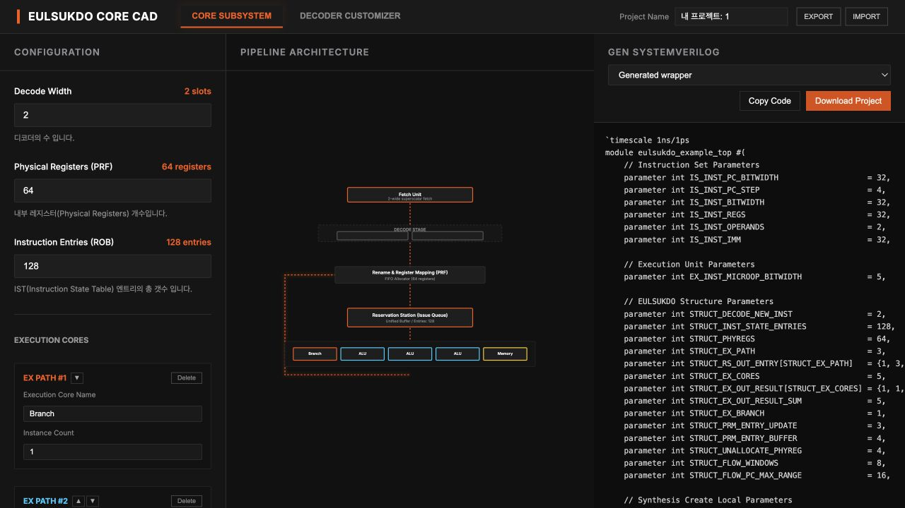
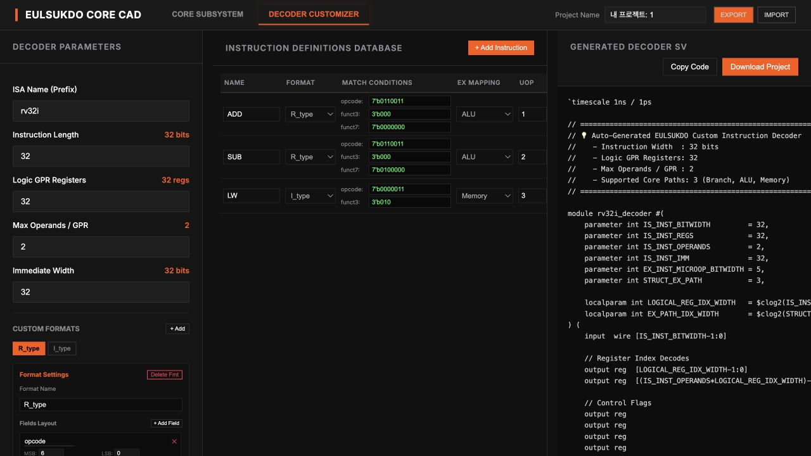

# 을숙도 생성기 사용설명서

이 앱에서는 스케줄러의 구조 값과 ISA 명령 정의를 정할 수 있습니다. 화면에서 보이는 코드를 복사할 수도 있고, **`Download Project`를 누르면 지금 설정으로 만든 top·디코더와 RTL 모듈 전체를 ZIP 하나로 받을 수 있습니다.**

## 1. 앱 열기

저장소 루트에서 실행합니다.

```sh
cd gen/generator-app
npm ci
npm run dev
```

터미널에 표시되는 로컬 주소를 브라우저에서 엽니다. 처음에는 `CORE SUBSYSTEM` 탭이 열립니다. Node.js와 npm이 필요합니다.

## 2. 구조 설정하기



상단 `Project Name`에 프로젝트명을 적습니다. 기본값은 `my_project`이고, ZIP과 그 안의 top 파일 이름에 쓰입니다. 왼쪽 `CONFIGURATION`의 값은 가운데 그림과 오른쪽 생성 top에 반영됩니다.

| 화면 입력 | 기본값 | 생성 코드에서 바뀌는 부분 |
| --- | ---: | --- |
| `Decode Width` | 2 | 한 번에 받는 명령 채널 수 `STRUCT_DECODE_NEW_INST` |
| `Physical Registers (PRF)` | 64 | 물리 레지스터 수 `STRUCT_PHYREGS` |
| `Instruction Entries (ROB)` | 128 | IST 엔트리 수 `STRUCT_INST_STATE_ENTRIES` |
| EX 경로의 `Instance Count` | Branch 1, ALU 3, Memory 1 | 경로별 RS 출력 채널 `STRUCT_RS_OUT_ENTRY`와 전체 EX 출력 채널 수 |

`+ Add New EX`로 경로를 추가하고, 각 경로의 이름·인스턴스 수를 바꿀 수 있습니다. `▲`·`▼`로 경로 순서를 바꾸면 디코더가 내보내는 경로 번호도 그 순서에 맞춰 달라집니다. `Delete`로 경로를 제거할 수 있지만, 현재 생성기는 경로가 최소 2개 있어야 합니다. 이름은 그림과 디코더 선택 메뉴에 쓰이고, 실제 EX 연산 회로가 새로 만들어지는 것은 아닙니다.

PRM의 갱신 폭·버퍼·반환 폭과 flow 창 수는 현재 화면 입력에는 없고 기본값 `3/4/4/8`을 씁니다. 상단 `Import`로 저장한 JSON에 해당 값을 넣어 불러올 수 있습니다. 구조 값은 양의 정수여야 하며, IST·물리 레지스터 수는 decode 폭보다 작을 수 없습니다. 잘못된 값이면 오류가 표시되고 ZIP 다운로드가 비활성화됩니다.

오른쪽 파일 선택 메뉴의 `Generated wrapper`가 설정을 적용한 top입니다. ZIP에 넣을 때 파일 이름은 `(프로젝트명)_eulsukdo_top.sv`가 됩니다. 그 아래 `eulsukdo_scheduler.sv` 등 10개 항목은 **현재 `gen/src/RTL/` 원본**입니다. 이 원본 파일들의 파라미터 선언 자체를 수정하는 방식이 아니라, 생성 top이 값을 전달하는 방식입니다. `Copy Code`는 현재 메뉴에서 보고 있는 파일 하나만 복사합니다.

## 3. ISA 디코더 설정하기

상단 `DECODER CUSTOMIZER`를 누릅니다.



1. 왼쪽에서 `ISA Name`, 명령 길이, 논리 레지스터 수, 소스 오퍼랜드 수, immediate 폭을 정합니다. `ISA Name`이 `rv32i`라면 ZIP에 `rv32i_decoder.sv`가 들어갑니다. 지금 지원하는 소스 오퍼랜드 수는 **2개**입니다.
2. `CUSTOM FORMATS`에서 포맷을 고르고 필드 이름과 `MSB`/`LSB`, 역할을 설정합니다. 역할은 조건 비교, `rd`, `rs1`, `rs2`, `imm`, 사용하지 않음 중 하나입니다. `+ Add`와 `+ Add Field`로 포맷과 필드를 늘릴 수 있습니다.
3. 가운데 명령 표에서 opcode·funct 조건, `EX MAPPING`, `UOP`, 목적 레지스터 할당(`ALLOC`), 점프·분기 플래그를 정합니다. `+ Add Instruction`과 `Remove`로 목록을 바꿉니다.
4. 오른쪽에서 생성된 디코더 코드를 확인합니다. `Copy Code`는 디코더 코드만 복사하고 `Download Project`는 구조 탭과 같은 ZIP을 받습니다.

처음 들어 있는 ADD/SUB/LW는 **예제 명령 3개**입니다. 전체 RV32I 구현이 아닙니다. 현재 필드 편집기는 한 필드의 연속 비트 구간을 immediate로 지정하므로, 비트가 흩어진 S/B/J형 immediate는 생성 로직을 확장해야 합니다. uop 번호도 실제로 연결할 EX와 맞춰 정해야 합니다.

## 4. 프로젝트 ZIP 받기

구조 탭과 디코더 탭 어느 쪽에서든 `Download Project`를 누르면 `(프로젝트명)_eulsukdo_rtl.zip`이 내려옵니다. 예를 들어 `Project Name`이 `my_project`이면 `my_project_eulsukdo_rtl.zip`이고, 압축 안의 top은 `my_project_eulsukdo_top.sv`입니다. 빈 이름은 다운로드할 수 없고, 공백이나 파일 이름에 쓸 수 없는 문자는 `_`로 바뀝니다. 한글 이름도 사용할 수 있습니다. 현재 파일 선택 메뉴가 원본 RTL을 가리키고 있어도 **ZIP 내용은 같습니다.**

```text
<프로젝트명>_eulsukdo_top.sv  ← 지금 구조·ISA 설정을 적용한 top
<ISA 이름>_decoder.sv         ← 지금 명령 정의를 적용한 디코더
RTL/
  _element_logics.sv
  eulsukdo_scheduler.sv
  flow_control_logic.sv
  flow_detect_unit.sv
  instruction_state_table.sv
  new_entry_logic.sv
  new_entry_logic_agent.sv
  physical_register_mapper.sv
  ready_station.sv
  write_back_concatenation.sv
```

압축을 푼 자리에서 기본 설정 파일을 문법 검사하는 예시는 다음과 같습니다.

```sh
verilator --lint-only --top-module eulsukdo_example_top \
  my_project_eulsukdo_top.sv rv32i_decoder.sv RTL/*.sv
```

파일 이름만 프로젝트명에 맞춰 바뀌며, SystemVerilog 안의 모듈 이름은 `eulsukdo_example_top` 그대로입니다. ZIP에는 **스케줄러와 디코더 소스**가 들어갑니다. 명령 메모리, 실제 ALU/분기/메모리 EX, 데이터 메모리와 실행 프로그램은 들어 있지 않습니다. 즉 ZIP만으로 완성된 CPU를 실행할 수는 없습니다. 디코더의 `exception_o`도 현재 스케줄러에서 trap 출력으로 이어지지 않습니다.

## 5. 설정 저장하고 다시 열기

상단 `Export`는 프로젝트명, 구조 값, ISA 파라미터, 포맷과 명령 목록을 `eulsukdo_cad_config.json`으로 저장합니다. 다시 작업할 때 `Import`에서 이 파일을 고르면 설정을 복원합니다. 예전에 저장한 JSON에 프로젝트명이 없으면 기본값 `my_project`를 씁니다. 같은 JSON을 [비주얼라이저](../sim_visualizer/USER_GUIDE.md)의 `Gen 구조 JSON 업로드`에도 넣을 수 있습니다. JSON은 구조 수치를 보여 주기 위한 것이고, 비주얼라이저의 실제 신호값은 VCD에서 읽습니다.

## 직접 확인한 결과

브라우저에서 decode 폭을 2에서 3으로 바꾸고 `Download Project`를 눌렀습니다. 내려받은 ZIP의 top에 `STRUCT_DECODE_NEW_INST = 3`이 들어 있었고, 12개 `.sv` 파일이 모두 들어 있었습니다. 프로젝트명을 `내 프로젝트: 1`로 바꿨을 때는 `내_프로젝트_1_eulsukdo_rtl.zip`으로 저장됐고, 디코더 탭에서도 같은 이름으로 ZIP을 받았습니다. `Export` JSON에도 프로젝트명이 들어 있었습니다. 이후 `topname_check`로 받은 ZIP 안에서 `topname_check_eulsukdo_top.sv`를 확인하고, 압축을 풀어 Verilator lint를 다시 통과했습니다. 앱 빌드와 lint도 통과했습니다.
