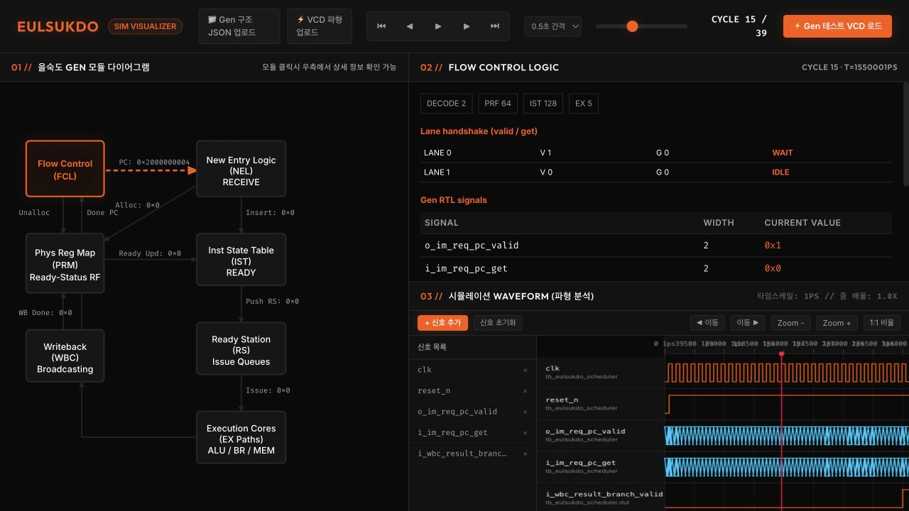

# 을숙도 시뮬레이션 비주얼라이저 사용설명서

이 앱은 스케줄러가 시뮬레이션 중 기록한 **VCD 파일**을 읽습니다. 모듈 그림, 현재 사이클의 신호값, 파형을 한 화면에서 비교할 수 있습니다. 웹앱이 RTL을 직접 실행하는 것은 아닙니다.

## 1. 앱 열고 데모 불러오기

저장소 루트에서 실행합니다.

```sh
cd gen/sim_visualizer
npm ci
npm run dev
```

브라우저에서 로컬 주소를 열고 상단 `Gen 테스트 VCD 로드`를 누릅니다. `gen/src/TB_UVM/tb_eulsukdo_scheduler.sv`를 실제로 실행해 만든 `public/gen_sample.vcd`가 열리고, 상단에 `CYCLE 0 / 39`가 표시됩니다. 현재 샘플에는 40개의 상승 에지 시점이 있습니다.

RTL이나 테스트벤치를 바꾼 다음 데모 파일도 갱신하려면 저장소 루트에서 다음을 실행합니다. Verilator가 필요합니다.

```sh
gen/sim_visualizer/generate_sample.sh
```

## 2. 화면 읽기



| 화면 위치 | 무엇을 볼 수 있나요? |
| --- | --- |
| 왼쪽 모듈 그림 | FCL, NEL, PRM, IST, RS, EX, WBC 중 하나를 클릭해 관찰 대상을 고릅니다. 선 옆 숫자는 선택한 사이클의 관련 신호값입니다. |
| 오른쪽 위 상세 패널 | 선택한 모듈의 신호 이름, 폭, 현재 값이 나옵니다. `DECODE/PRF/IST/EX`는 구조 설정값입니다. |
| 오른쪽 아래 파형 | 선택 모듈에서 자주 보는 신호가 기본으로 표시됩니다. 시간축 위에서 변화 순서를 확인합니다. |
| 상단 재생 바 | 처음 `⏮`, 이전 `◀`, 재생/일시정지, 다음 `▶`, 마지막 `⏭`, 속도와 슬라이더로 사이클을 이동합니다. |

상단 `CYCLE 15 / 39`는 총 40개 중 15번 상승 에지 시점을 보고 있다는 뜻입니다. 상세 패널의 `T=...`는 VCD 타임스케일을 따른 시각입니다. 여러 비트 신호는 `0x...`로, 한 비트 신호는 `0` 또는 `1`로 표시합니다. VCD에 기록되지 않은 신호는 `VCD에 없음`으로 남습니다.

FCL, NEL, RS/EX를 고르면 레인별 `V`(valid), `G`(get)와 상태가 나옵니다. 같은 레인의 두 값이 모두 1이면 `ACCEPT`, valid만 1이면 `WAIT`, valid가 0이면 `IDLE`입니다. 예를 들어 캡처한 15번 사이클은 FCL 레인 0이 `V=1, G=0`이므로 `WAIT`이며, 상세 신호도 `o_im_req_pc_valid=0x1`, `i_im_req_pc_get=0x0`으로 보입니다.

## 3. 파형 다루기

1. 왼쪽 그림에서 모듈을 선택하면 그 모듈의 주요 신호로 파형 목록이 바뀝니다.
2. `+ 신호 추가`를 눌러 VCD의 신호 이름이나 경로를 검색하고 필요한 신호를 고릅니다. 목록의 `×`로 개별 신호를 빼거나 `신호 초기화`로 목록을 비울 수 있습니다.
3. `Zoom +`·`Zoom -`로 시간축을 확대·축소하고 `1:1 비율`로 되돌립니다. `◀ 이동`·`이동 ▶`으로 파형을 좌우로 움직입니다.
4. 파형의 원하는 지점을 클릭하면 가장 가까운 상승 에지 사이클로 이동합니다. 상단 슬라이더나 이전/다음 버튼으로도 같은 사이클을 고를 수 있습니다.

분기 뒤의 흐름을 보려면 FCL에서 `i_wbc_result_branch_valid`와 `o_im_req_pc`를 순서대로 보고, NEL에서 `i_im_recv_pc`와 `o_im_recv_inst_get`을 비교하면 됩니다. 이때 flow ID를 포함한 PC 태그가 함께 움직이는지 확인하세요.

## 4. 내 VCD와 구조 JSON 넣기

- `VCD 파형 업로드`: Verilator 등에서 만든 `.vcd`를 엽니다. `clk` 또는 `clock`의 0→1 변화를 기준으로 사이클을 잡습니다. 필요한 내부 신호는 테스트벤치에서 덤프해 두어야 합니다.
- `Gen 구조 JSON 업로드`: 생성기 `Export`로 저장한 `eulsukdo_cad_config.json`을 엽니다. `DECODE/PRF/IST/EX` 수치와 그림의 코어 구성이 바뀝니다.

JSON이 파형값을 만들어 주지는 않습니다. 구조 JSON과 VCD가 서로 다른 설정에서 나온 경우에는 표시한 구조 수치와 실제 레인 수가 다를 수 있습니다. 가능하면 같은 설정에서 만든 두 파일을 함께 쓰세요.

## 직접 확인한 결과

현재 RTL에서 데모 VCD를 다시 만들고 앱에서 로드했습니다. 40개 사이클이 읽혔고, FCL을 고른 뒤 15번 사이클에서 위 valid/get과 PC 요청값을 확인했습니다. 앱 빌드는 통과했고 lint도 종료 코드 0으로 끝났습니다. lint에는 React effect의 상태 설정에 관한 경고 1건이 남아 있습니다.
